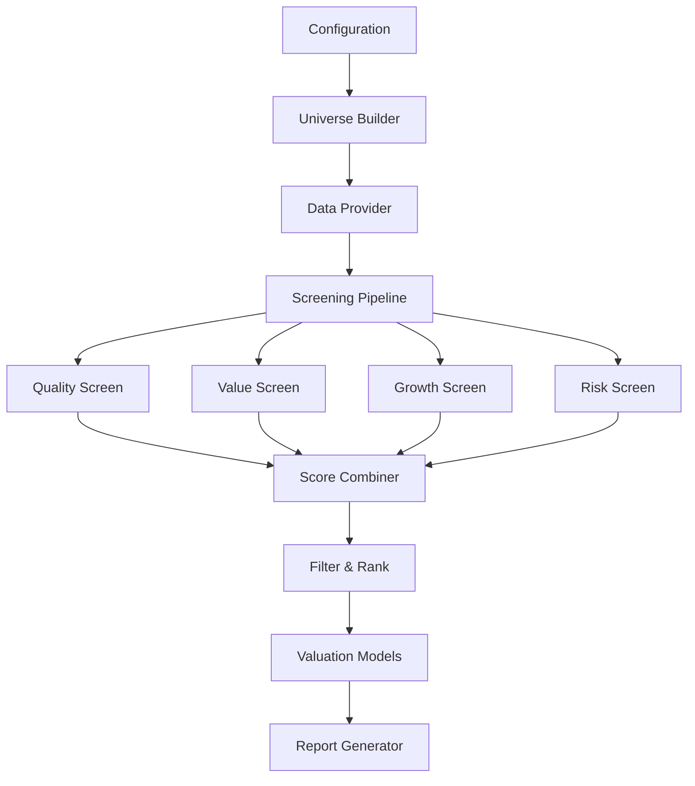

# Architecture

The Systematic Investment Analysis Framework follows a modular, pipeline-based architecture designed for extensibility and maintainability.

## System Overview

## Core Components

### 1. Configuration System
- **Location**: `src/invest/config/`
- **Purpose**: YAML-based configuration management
- **Key Files**: `schema.py`, `loader.py`

### 2. Data Layer
- **Location**: `src/invest/data/`
- **Purpose**: Data retrieval and normalization
- **Key Files**: `yahoo.py`

### 3. Analysis Pipeline
- **Location**: `src/invest/analysis/`
- **Purpose**: Orchestrates the analysis workflow
- **Key Files**: `pipeline.py`, `sector_context.py`

### 4. Screening Modules
- **Location**: `src/invest/screening/`
- **Purpose**: Individual screening dimensions
- **Key Files**: `quality.py`, `value.py`, `growth.py`, `risk.py`

### 5. Valuation Models
- **Location**: `src/invest/`
- **Purpose**: Intrinsic value calculations
- **Key Files**: `dcf.py`, `rim.py`

### 6. Reporting System
- **Location**: `src/invest/reports/`
- **Purpose**: Output generation and formatting
- **Key Files**: `templates.py`

## Design Principles

### Modularity
Each component has a single responsibility and can be tested independently.

### Extensibility
New screening criteria, data sources, and valuation models can be added without modifying existing code.

### Configuration-Driven
All analysis parameters are externalized to YAML configuration files.

### Data Pipeline
Clear separation between data retrieval, processing, and output generation.

## Next Steps

- **[Pipeline Components](pipeline-components.md)** - Detailed component analysis
- **[Adding New Screeners](adding-screeners.md)** - Extension guide
- **[Data Providers](data-providers.md)** - Data integration patterns