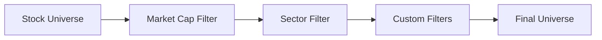

# User Guide Overview

The Systematic Investment Analysis Framework provides a comprehensive, objective approach to stock screening and analysis. This guide will help you master all aspects of the system.

## What This Framework Does

### Core Functionality

The framework performs systematic analysis of stocks through a multi-stage pipeline:

1. **Universe Selection** - Choose stocks to analyze (S&P 500, custom lists, sectors)
2. **Data Collection** - Fetch financial metrics from Yahoo Finance  
3. **Quality Screening** - Evaluate financial strength and stability
4. **Value Assessment** - Analyze valuation metrics and ratios
5. **Growth Analysis** - Assess business growth and prospects
6. **Risk Evaluation** - Identify financial and business risks
7. **Valuation Modeling** - Apply DCF and RIM models
8. **Results Generation** - Produce reports and data exports

### Key Benefits

**Eliminates Bias**: Every stock goes through identical analysis steps

**Configurable**: Define your investment criteria without coding

**Comprehensive**: Analyzes quality, value, growth, and risk systematically

**Reproducible**: Same inputs always produce same outputs

**Scalable**: Analyze individual stocks or entire market indices

## Analysis Pipeline

### Stage 1: Universe Building

The framework starts by building a universe of stocks to analyze:



**Sources:**
- S&P 500 constituents
- Custom ticker lists
- Sector-based selection
- Market cap ranges

### Stage 2: Data Collection

For each stock, the framework fetches:

- **Basic Data**: Price, market cap, sector, industry
- **Financial Ratios**: P/E, P/B, EV/EBITDA, etc.
- **Profitability**: ROE, ROIC, profit margins
- **Growth Metrics**: Revenue/earnings growth rates
- **Financial Health**: Debt ratios, liquidity measures

### Stage 3: Multi-Dimensional Screening

Each stock receives scores across four dimensions:

#### Quality Assessment (0-100 points)
- Return on Invested Capital (ROIC)
- Return on Equity (ROE) 
- Current ratio (liquidity)
- Debt-to-equity ratio
- Interest coverage

#### Value Analysis (0-100 points)
- Price-to-Earnings (P/E) ratio
- Price-to-Book (P/B) ratio
- Enterprise Value to EBITDA
- Price-to-Free Cash Flow
- Dividend yield considerations

#### Growth Evaluation (0-100 points)
- Revenue growth rate
- Earnings growth rate
- Free cash flow growth
- Book value growth
- Growth sustainability metrics

#### Risk Assessment (0-100 points, lower is better)
- Beta (market risk)
- Financial leverage
- Business model stability
- Sector-specific risks
- Cyclical adjustments

### Stage 4: Composite Scoring

Scores are combined using weighted averages:

```
Composite Score = (Quality × 30%) + (Value × 30%) + (Growth × 25%) + (Risk × 15%)
```

Risk scores are inverted (lower risk = higher contribution to composite score).

### Stage 5: Filtering and Ranking

**Filtering**: Stocks must meet minimum thresholds:
- Quality Score ≥ 40
- Value Score ≥ 30  
- Growth Score ≥ 20
- Risk Score ≤ 80
- Composite Score ≥ 50

**Ranking**: Stocks are sorted by composite score (or user-specified criterion).

### Stage 6: Valuation Models

Top candidates undergo detailed valuation:

**Discounted Cash Flow (DCF)**:
- Projects future cash flows
- Applies appropriate discount rate
- Calculates intrinsic value per share

**Residual Income Model (RIM)** (planned):
- Book value-based approach
- Focuses on economic profits
- Alternative valuation perspective

## Interactive Dashboard

The **Interactive Dashboard** provides a live web interface for real-time investment analysis:

```bash
poetry run python scripts/dashboard_server.py
# Opens automatically at http://localhost:8080
```

**Key Features:**
- **Live Valuations**: Compare DCF, Enhanced DCF, and Simple Ratios side-by-side
- **One-Click Updates**: Refresh all data with button click
- **Real-Time Prices**: Current market data with upside/downside calculations
- **Interactive Tooltips**: Hover explanations for all metrics
- **Professional Interface**: Clean, responsive design with visual feedback

See [Dashboard Guide](dashboard.md) for detailed usage instructions.

## Output Formats

### 1. Executive Summary Report

High-level overview with:
- Total stocks analyzed
- Number passing filters
- Top recommendations
- Sector breakdown
- Key insights

### 2. Detailed Stock Reports

For each stock:
- Company overview
- Quality assessment details
- Value analysis breakdown  
- Growth evaluation
- Risk assessment
- Valuation results (if applicable)
- Investment thesis summary

### 3. CSV Data Export

Structured data including:
- All stocks analyzed
- Pass/fail filter status
- Detailed scores and metrics
- Financial ratios
- Ready for spreadsheet analysis

### 4. JSON Data Export

Raw data in JSON format:
- Complete analysis results
- Configuration used
- Intermediate calculations
- API integration ready

## Understanding Filter Results

### Passes_Filters = Y (Yes)

Stock meets all screening criteria:
- **Quality**: Strong financial metrics
- **Value**: Attractive valuation
- **Growth**: Positive business momentum  
- **Risk**: Acceptable risk profile
- **Overall**: Recommended for further analysis

### Passes_Filters = N (No)

Stock fails one or more criteria. Common reasons:

**Quality Issues**:
- Low ROE or ROIC
- High debt levels
- Poor liquidity ratios

**Value Concerns**:
- High P/E ratio (overvalued)
- Excessive P/B ratio
- Premium EV/EBITDA multiples

**Growth Problems**:
- Declining revenues
- Negative earnings growth
- Deteriorating fundamentals

**Risk Factors**:
- High volatility (beta)
- Financial leverage
- Sector-specific concerns

## Sector-Specific Considerations

The framework automatically adjusts expectations by sector:

### Technology Sector
- **Higher P/E acceptable**: Growth companies command premiums
- **R&D investments**: May temporarily depress margins
- **Scalability**: High incremental margins expected

### Utilities Sector  
- **Lower growth expected**: Regulated, stable businesses
- **Higher debt tolerance**: Infrastructure requires capital
- **Dividend focus**: Steady cash flow distribution

### Financial Sector
- **Different debt metrics**: Debt is part of business model
- **Interest rate sensitivity**: Performance tied to rate environment
- **Regulatory considerations**: Capital requirements and compliance

### Energy Sector
- **Cyclical adjustments**: Commodity price volatility
- **Capital intensity**: High fixed costs and depreciation
- **Environmental factors**: Transition and sustainability risks

## Best Practices

### Starting Your Analysis

1. **Define Investment Thesis**: What type of stocks are you seeking?
2. **Choose Appropriate Config**: Conservative, growth, value, or custom
3. **Set Realistic Expectations**: Understand typical sector characteristics
4. **Review Results Critically**: Numbers don't tell the whole story

### Interpreting Results

1. **Focus on Pass/Fail First**: Understand why stocks are filtered out
2. **Compare Within Sectors**: Tech vs tech, utilities vs utilities
3. **Consider Market Context**: Bull vs bear market conditions
4. **Look for Red Flags**: Unusual metrics or deteriorating trends

### Common Pitfalls to Avoid

**Over-Optimization**: Don't adjust criteria to fit predetermined conclusions

**Ignoring Sector Context**: A 40 P/E might be reasonable for growth tech

**Mechanical Application**: Use quantitative results to guide, not replace, qualitative analysis

**Timing Ignorance**: Great companies at wrong prices are poor investments

## Getting Help

### Documentation Structure

- **Getting Started**: Installation, quick start, configuration basics
- **User Guide**: Comprehensive usage (this section)
- **Developer Guide**: Extending and customizing the framework
- **API Reference**: Technical documentation
- **Tutorials**: Step-by-step examples

### Support Resources

- Review [common issues](troubleshooting.md) and solutions
- Check [GitHub issues](https://github.com/rubenayla/invest/issues) for similar problems
- Study [configuration examples](../getting-started/configuration.md) for guidance
- Follow [tutorials](../tutorials/basic-screening.md) for hands-on learning

## Next Steps

- **[Interactive Dashboard](dashboard.md)** - Live web interface for real-time analysis
- **[Running Analysis](running-analysis.md)** - Detailed execution guide
- **[Understanding Results](understanding-results.md)** - In-depth result interpretation  
- **[Configuration Options](configuration-options.md)** - Advanced customization
- **[Output Formats](output-formats.md)** - Working with generated data