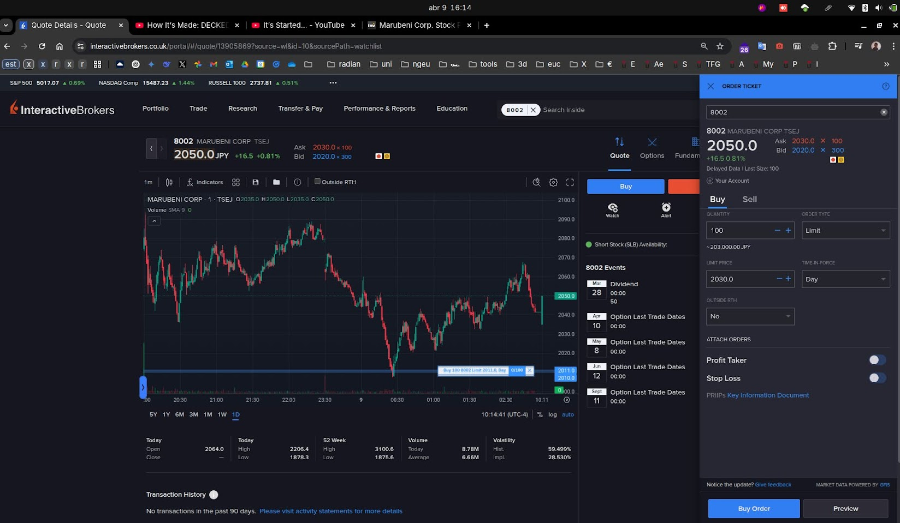

## DCF for Qualcomm (QCOM)
---
Si tengo dinero invertido y sufro una caída generalizada del mercado, probablemente bajarán los tipos de interés, con suerte a casi 0.
La pignoración implica que el banco me presta un % del valor de mis acciones (que ahora valen menos). Prestan 50-60% del valor de mercado de las acciones si están en un fondo indexado, considerado seguro. Si tenía 100k y ha caído un 40%, ahora tengo 60k. Al pignorarlos al 50% nos prestan otros 30k, tenemos 90k. Con esto compramos más participaciones, y pasamos a tener 90k en el momento más bajo del mercado.
De media según datos históricos del sp500 1 año después subirá un 40%, la peor situación en la historia se dio en 1987 donde sólo subió un 22.5%. 2 años después de media un 70%. y 5 años después un 100%. Para la devolución del dinero, pagaremos intereses similares a los tipos de interés. Trimestralmente se pagan los intereses calculados por año, divididos a partes iguales en los 4 trimestres del año. Con 2% anual de tasa de interés serían 600€, 150€ cada trimestre. En total, los 100k que cayeron a 60k se han transformado en 90*.7=153k-30k (deuda) - 600*2 (intereses 2%) = 121k

## 2025-04-04 Fall of stocks due to Trump's tariffs
I have lots of cash ready to buy so it's a great situation. I'm not sure how low will this get, so I'll just dollar-cost average in this specific period of low prices

### STLD
https://app.tikr.com/stock/financials?cid=34768&tid=2654552&ref=bvi61n&tab=is

## 2025-04-08
Rallo https://youtu.be/VWClThyfDlQ?si=NUhi2H437V3OVa0T
> The value of an asset is the present value of its future cash flows, discounted at the required rate of return.

- financing cost = weighted average of cost of equity and cost of debt
    - Cost of equity = risk-free rate + beta * (market return - risk-free rate)
        - Risk-free rate = yield on 10-year government bonds
    - Cost of debt = (Risk-free rate + default spread) * (1 - tax rate)
- Future cash flows
    - Calculate the current ones: Net income (consider the operating one)
    - Free cash flow = after tax operating income * (1 - reinvestment rate)
    > what happens when the company reinvests all its cash flows? It's not giving net income but its intrinsic value is increasing
    Affected by the growth, which increases with reinvestmente rate, and by the % of cash flow that can be extracted, which decreases with reinvestment rate

# notes to really intuitively understand bond markets and its behavior
So right now (2025-06-09) USA interest rates are high, about 5%, yield curve is inverted, which means expectation of recession in the next 1-2 years, and inflation moderately high, trending down but hardly, at about 3%. It's sticky. Right now the rates are expected to stay high for a while, it's time to prepare, so at the end of the year the time may be good to buy bonds, until mid-recession there are investment opportunities and the bonds can be sold at a profit, using the liquidity for investment opportunities.

Inflation is sticky because certain factors caused prices to rise, especially salaries, and once they rise they don't go back down. About housing, mortgage rates are high, which makes potential buyers stay renting. The rates make renting artificially more attractive, raising the short term renting price. Oil may cause price fluctuations affecting the behavior of the fed.

The ideal interest rates behavior is high, giving me more money, but trending down, which means the value of the bond will rise, since bonds with such returns will be scarce. The fed will drop interest rates only if inflation is low enough, or if Trump can convince them.

So ideally i should buy 1yr bonds now, and then when the rates start dropping, buy longer term.

U.S.-domiciled ETFs (like SGOV/SHY) get hit with 15% dividend withholding tax for non-US investors, so choose UCITS ETFs, Ireland-based wrappers.
gpt recommends: iShares $ Treasury Bond 1-3yr UCITS ETF (IB01 / IBGS). 4.7% gross yield to maturity, 1.9 years.
Either IB01 (Xetra: German electronic stock exchange) or IBGS (London)
I found this one at 1 year, even better.
https://www.interactivebrokers.co.uk/portal/?loginType=1&action=ACCT_MGMT_MAIN&clt=0#/quote/354802220

TER of .07%
> Note: IB01 doesn't hold to maturity, they buy and sell constantly, so if rates drop, this won't benefit from the price appreciation of higher-than-market bonds. For that, consider IBGL or IBTL when rates start dropping. They are higher duration, which means more price appreciation when rates drop.
> Gpt: yes, if you don't sell, this etf will accumulate yield internally, reflect that in price appreciation, just like holding T-bills to maturity.

# 
El Federal funds rate es el tipo que la fed cobra para préstamos a 1 día, anualizado.
La fed controla el tipo efectivo de los bancos ajustando el suyo: Si desean incrementar los tipos, reducen liquidez en la economía al vender bonos. Eso lo hacen subiendo los tipos de interés que ellos pagan, haciendo que no tenga sentido la compra de bonos a interés inferior. Esto causa la subida de los tipos de interés en el mercado, y la fed absorbe liquidez de la economía.

Este proceso permite a la fed financiarse, con la pega de tener que pagar grandes intereses. En la discusión de Trump con Powell, Trump quiere aumentar la liquidez de la economía con tipos bajos, pero Powell los mantiene altos. Por qué los mantiene altos? Para evitar demasiada inflación.

Efecto: Imprimir dinero y financiar obras públicas con ello, aumentando en el proceso la cantidad de dinero circulando en la economía, por lo tanto los precios suben porque el valor del dinero baja, pero el mismo gobierno vende bonos (pide dinero) con tipos de interés altos, reduciendo la cantidad de dinero en la economía, con el efecto de eliminar la inflación EN EL CORTO PLAZO, ya que tendrá que devolver los intereses de los bonos en algún momento (endeudarse infinitamente es una locura). Al bajar los tipos se libera toda la inflación acumulada de golpe, y como financie los intereses imprimiendo dinero, la inflación será todavía mayor que la original. La causa de la inflación sistémica a largo plazo, la depreciación real del dinero, es la impresión, no los bonos.

Conclusión: Sólo evita inflación a corto plazo, en el futuro el problema será todavía mayor si no baja los tipos.
Estoy con Trump en este caso: deberíamos bajar los tipos y permitir que la inflación se sufra gradualmente, y ante todo dejar de endeudarnos a intereses tan altos, con el problemón de deuda que ya tenemos.

#
Si la curva de tipos se invierte, es indicador de recesión porque los tipos bajos a largo plazo solo tienen sentido si hay suficientes personas comprándolos como para mantener un precio inferior al corto-medio plazo. Esto ocurre porque los inversores no creen que puedan conseguir tipos similares con bonos o acciones, o cualquier otro activo a largo plazo. Es decir, esperan que los tipos a corto plazo, no sólo en bonos sino en el mercado en general, bajen en el futuro, y por lo tanto prefieren comprar bonos a largo plazo ahora, aunque tengan un tipo de interés más bajo que los a corto plazo. Si compran un bono a corto plazo con mayor interés, cuando el bono acabe no tendrán las mismas oportunidades que tienen ahora durante los años siguentes. Es decir, ellos mismos esperan recesión, como en un mercado de apuestas.

Sin embargo, el control directo sobre la recesión lo tiene la fed, al subir los tipos y vaciar la economía de liquidez, dando rentabilidad a los acreedores y chupando todo el dinero del resto de empresas. Básicamente es hacerle dumping a toda la economía con el dinero de los contribuyentes.

Curva de tipos en 3d: https://www.nytimes.com/interactive/2015/03/19/upshot/3d-yield-curve-economic-growth.html

Tipos bajos pueden ser el gobierno queriendo estimular la economía y dejarse de deudas, o simplemente que no necesitan subir los tipos para financiarse, porque la economía está en la mierda y no hay muchas alternativas más, entonces con poco interés que paguen ya tienen financiación.

Básicamente pensar que la fed está tirando de la curva para arriba cuando se quiere financiar, y el mercado se queda abajo si tiene otras opciones mejores, no le interesa. Para convencerle tienes que tirar más fuerte subiendo mucho. Si la curva está abajo es porque o bien no quieres financiarte, o bien el mercado se ofrece fácilmente, porque no tiene alternativas mejores.

